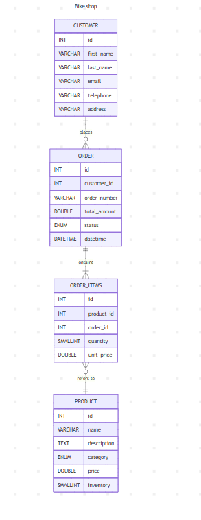

# Design Document

By Matheus Teles Marques

## Scope

The database developed for the `Ciclo Universo` bicycle store is designed to manage orders and inventory, updating stock levels, and storing customer information for support and service. To meet these objectives, the database includes the following entities:

* Customers, including basic information for registration and identification
* Products, including basic product information, in particular product category as the Ciclo Universo store does not only sell bicycles
* Orders, including the number to identify the order, the date and time it was made,
* Items ordered, including the quantity of the item and the price per unit at the time the item was ordered

Out of the scope are elements like employees, suppliers and payment and discount systems, that were not considered for this initial version of the system that focuses exclusively on orders and inventory.

## Functional Requirements

This database will be able to support:

* Track customer data (contact info, order history)

* Manage product catalog (prices, categories, stock levels)

* Process orders (with item details and historical pricing)

* Update stock automatically when order occur

The system as it was developed is not yet capable of managing employees, maintaining a list of suppliers, processing payment transactions, or applying discounts following some certain logic that should be developed for this.

## Representation

### Entities
The database includes the following entities:

#### Customers

The `customers` table includes:

* `id`, which specifies the unique ID for the customer as an `INT`. This column has the `PRIMARY KEY` constraint applied.
* `first_name`, which specifies the customer's first name as `VARCHAR`, given `VARCHAR` is appropriate for name fields.
* `last_name`, which specifies the customer's last name. `VARCHAR` is used for the same reason as `first_name`.
* `email`, which specifies the customer's email. `VARCHAR` is used for the same reason as `first_name`. A `UNIQUE` constraint is applied to ensure that two customers cannot have the same email and a `CHECK` constraint validates the email provided.
* `telephone`, which specifies the customer's telephone. `VARCHAR` is used here because it supports special characters and if we want to improve by implementing some more sophisticated validation logic for pattern or size, so `VARCHAR` is the appropriate type. A `CHECK` constraint is applied to ensure that the telephone number provided has 11 digits, which is standard in Brazil.
* `address`, which specifies the customer's address. `VARCHAR` is used because it is appropriate for address names

#### Products

The `products` table includes:

* `id`, which specifies the unique ID for the product as an `INT`. This column has the `PRIMARY KEY` constraint applied.
* `name`, which specifies the product's name as `VARCHAR`.
* `description`, which specifies the product's description as `TEXT`.
* `category`, which specifies the product's category as `ENUM` to delimit a list of accepted entries for the field.
* `price`, which specifies the product's price as `DECIMAL`, given `DECIMAL` is appropriate for columns that store floating point numbers by maintaining precision. A `CHECK` constraint is applied to ensure that price values ​​are always greater than 0.
* `inventory`, which specifies the quantity of the product in question in inventory as `SMALLINT`.
#### ORDERS

The `orders` table includes:

* `id`, which specifies the unique ID for the order as an `INT`. This column has the `PRIMARY KEY` constraint applied.
* `customer_id`, which is the ID of the customer who made the order as an `INT`. This column has the `FOREIGN KEY` constraint applied, referencing the `id` column in the `customers` table to ensure data integrity.
* `order_number`, which specifies the order number. `VARCHAR` is used here because it supports special characters and if we want to improve by implementing some more sophisticated validation logic for pattern or size, `VARCHAR` is the appropriate type. A `UNIQUE` constraint is applied because there cannot be two orders with the same number.
* `total_amount`, which specifies the total value of the order as `DECIMAL`. A `DEFAULT` constraint sets 0 as the default value of the column, since the real value will be calculated dynamically according to the quantity of items ordered and their price per unit.
* `status`, which specifies the order status as `ENUM`. A `DEFAULT` constraint sets `pending` as default value when nothing is informed.
* `datetime`, which specifies the the date and time of the order. The `datetime` field is stored as `DATETIME` and the default value for the attribute is the current timestamp, as denoted by `DEFAULT CURRENT_TIMESTAMP`.

#### ORDER_ITEMS

The `order_items` table includes:

* `id`, which specifies the unique ID for the order and product relationship as an `INT`. This column has the `PRIMARY KEY` constraint applied.
* `product_id`, which is the ID of the product contained in the order as an `INT`. This column has the `FOREIGN KEY` constraint applied, referencing the `id` column in the `products` table to ensure data integrity.
* `order_id`, which is the ID of the order as an `INT`. This column has the `FOREIGN KEY` constraint applied, referencing the `id` column in the `orders` table to ensure data integrity.
* `quantity`, which specifies the quantity of items ordered as an `SMALLINT`. A `CHECK` constraint is applied to ensure that quantity ordered is always greater than 0.
* `unit_price`, which specifies the price per unit of the item ordered as an `DECIMAL`. A `DEFAULT` constraint sets 0 as the default value of the column, since the real value is obtained directly from the price column of the products table.

### Relationships

The entity relationship diagram below describes the relationships between database entities.

As shown in the diagram:

* A customer can place zero or more orders. Zero, if he has registered but has not yet placed an order in the store. While an order is made by one customer and only one customer.
* An order can contain one or more products. While a product can belong to zero or more orders. Zero, if a product exists in the system without being included in an order yet.

## Optimizations

To encapsulate common database queries and simplify them, several views were created, all documented in the `schema.sql`. The views created were for:

* Products in stock or out of stock
* Orders filtered by status
* Order details
* Purchase summaries for store customers
* Products ranked by sales volume
* Daily sales totals and revenue

To optimize frequent queries, indexes were implemented:

* An index on the `inventory` column to accelerate stock status checks
* An index on the `status` column to speed up order filtering
* An index on the `datetime` column to enhance daily sales reporting

## Limitations

The database for `Ciclo Universo` has several important limitations that need addressing in future versions:

* An issue is the absence of `supplier management`, which makes it difficult to track product origins or manage the restocking process efficiently.

* The system also lacks `employee management features`, preventing the tracking of which staff members handle specific orders or any analysis of their performance.

* The database also lacks a `payment system`, making it impossible to track payment methods or reconcile financial transactions with orders. This prevents implementation of features like installment payments.

* Another limitation is the absence of a `discount or promotion system`, which significantly restricts marketing options.

* A frustrating operational challenge is the requirement for `manual order status updates`. Attempts to implement triggers to automate this process were unsuccessful. This manual updating is time-consuming and prone to errors, as staff must remember to change each status throughout the order lifecycle instead of having the system handle those transitions automatically. One option to deal with this limitation would be to delegate this responsibility outside of the database, to the application layer. This approach would allow for the implementation of more complex business logic and rules for status transitions, rather than trying to handle this process within the database itself.

